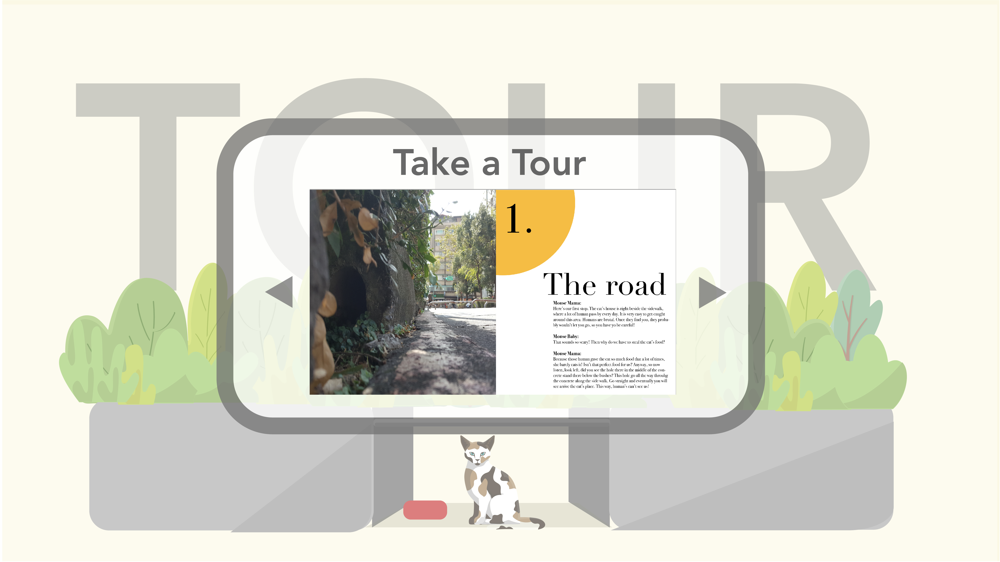
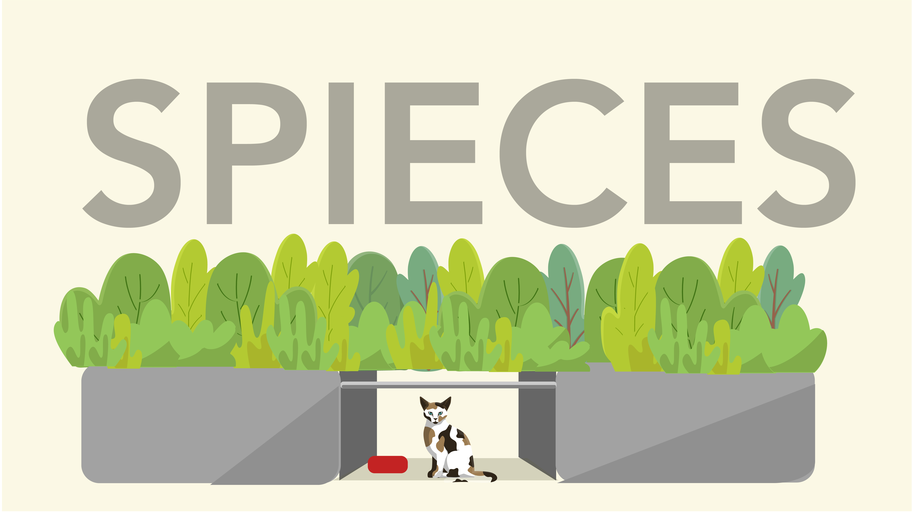
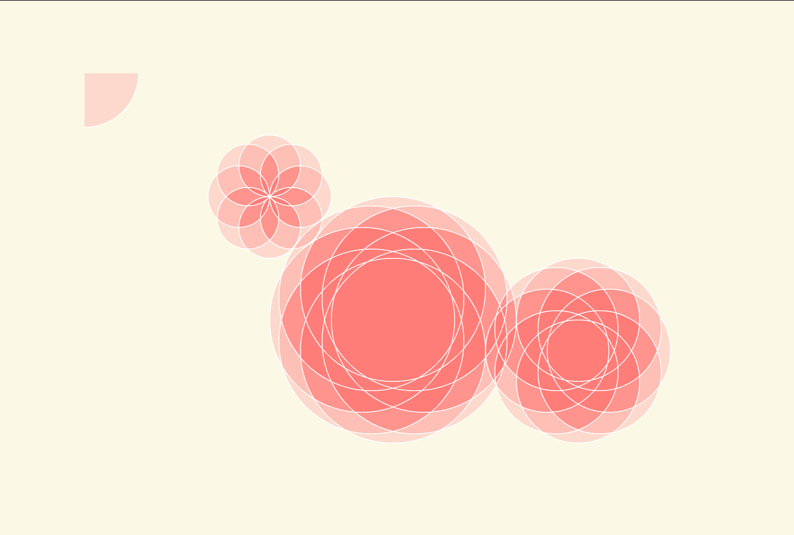
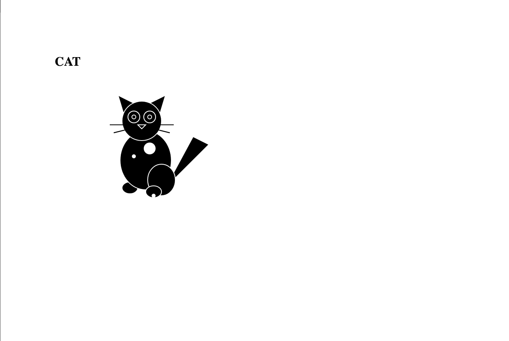
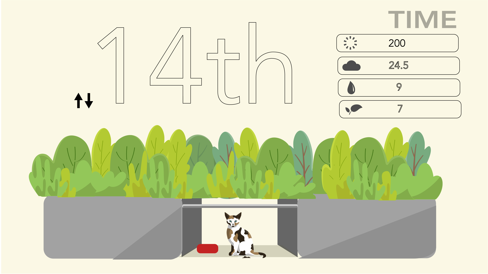

# 🌱 Sustainable System Site Map Website 🌊
This is June's Site Map from 2021 Sustainable System Class. This website insludes the time journal, tour, hydr-map, living observation of the site. It also includes "Mental Color of Plants" - a tool I invented to test the how the plants are feeling with color representations. 
 

[💻 DEMO](https://junebee66.github.io/SustainableSystem_Spring2021/sustainable_systems/html/index_mantal%20_color_%20of_plants.html)
 
[📕 Medium](https://medium.com/@junesthoughts/tracking-a-street-cats-life-through-sustainable-systems-a-microsystem-journey-1e9a5a2d14fc)
 

## 01. Design Projects

### One Inch Tour
By clicking the “Take a Tour” button, a pop-up window showcasing the **One Inch Tour** project will appear in slideshow format.

**About Project**: This project offers a unique perspective, following the journey of a one-inch-tall mouse as it explores a microsystem in a neighborhood park in Taipei City’s United Village. The park is home to a community-cared street cat that inhabits a small shelter. The tour, narrated by a mother mouse teaching her child how to navigate the space, provides a fascinating look into this miniature ecosystem.

Navigate a Sustainable Systems Site as a One Inch Mouse 🐭  
[One Inch Tour | 2020 on Medium](https://medium.com/@junesthoughts/navigate-a-sustainable-systems-site-as-an-once-inch-mouse-d9e7cec1e09c)

---

### Hydroform
By clicking the water icon button labeled “Hydro”, a pop-up window of the **Hydroform** project will be displayed in slideshow format.

**About Project**: The **Hydroform** artwork explores the relationship between water and the microsystem of a neighborhood site observed over half a year. The project reflects on how water affects this ecosystem and, by extension, our planet. Through changing weather conditions — sunny, stormy, rainy — it captures seasonal shifts in the behavior of the community-cared street cat. By freezing water with withered spring flowers, the project preserves the essence of the season, symbolizing the continuity of life and time within the microsystem.

---

### Time Journal
By clicking the sun icon button labeled “Weather”, the site will redirect to the **Mental Colors of Plants** page. Click the middle button labeled “Time Journal” to open a pop-up window showcasing the **Cat’s Journal** project in slideshow format.

**About Project**: This journal is a 13-page consecutive documentation of the sustainable system site, one page for each week. It offers observational analysis of the street cat’s life and its environment, focusing on its behavior, the community’s care, and the ecosystem's health.

---

### Cat’s Journal
By clicking on the water icon button, a pop up window of cat’s journal project will show up. It is in slideshow format.

**About Project**: This journal is my observational analysis of the street cat’s life and its surroundings — the neighborhood park. The journal documents details of the cat’s behavior and the environment it lives in, such as the care it receives from the community and the shelter they built for it. It serves as part of your broader project, offering insights into the health of the ecosystem in which the cat resides.

## 02. Coding / Making

### Sketch 1: Sustainable System’s Site

This is a site I’ve been studying and observing for my Sustainable Systems class over the past 8 months. It’s a neighborhood park near my home, where a street cat has lived under a plastic shelter for nearly two years. The community collectively provides food and water for the cat, essentially raising her. The story of this cat has been closely intertwined with my online school life, adding a fantasy-like element to this year.

I’m also applying what I’ve learned in my Digital Craft class by creating a **Mental Health Detector of Plants**. This tool records daily environmental and behavioral data of a plant, converting the data into RGBA and HEX color codes. The final detector will show how the plant is feeling using these color schemes (e.g., "my jasmine is feeling yellow today, my rose felt purple last night").

Drawing these sketches will help develop the final website app for the Mental Health Detector of Plants. It’s exciting to see how different fields cross and reinforce each other in meaningful ways.

- Website: [Sustainable Systems Site](https://junebee66.github.io/School/sustainable_systems/html/index_mantal%20_color_%20of_plants.html)
- HTML: [GitHub Sketch 1](https://github.com/junebee66/SP21-PUFY1225-DIGITAL-CRAFT/blob/main/p5/sketch_4_cat_scene.html)
- JS: [GitHub Sketch 1 (JS)](https://github.com/junebee66/SP21-PUFY1225-DIGITAL-CRAFT/blob/main/js/sketch_4_cat_scene_backup.js)

---

### Sketch 2: Orange Jasmine

- Website: [Orange Jasmine Sketch](https://junebee66.github.io/SP21-PUFY1225-DIGITAL-CRAFT/p5/sketch_5_orange_jasmine.html)
- HTML: [GitHub Sketch 2](https://github.com/junebee66/SP21-PUFY1225-DIGITAL-CRAFT/blob/main/p5/sketch_5_orange_jasmine.html)
- JS: [GitHub Sketch 2 (JS)](https://github.com/junebee66/SP21-PUFY1225-DIGITAL-CRAFT/blob/main/js/sketch_5_orange_jasmine.js)

---

### Sketch 3: Weather Icons / Black Cat

Initially trying to draw weather icons, I later decided to draw a cat due to the complexity of the curve lines.

- Website: [Weather Icons / Black Cat Sketch](https://junebee66.github.io/SP21-PUFY1225-DIGITAL-CRAFT/p5/sketch_6_weather_icon.html)
- HTML: [GitHub Sketch 3](https://github.com/junebee66/SP21-PUFY1225-DIGITAL-CRAFT/blob/main/p5/sketch_6_weather_icon.html)
- JS: [GitHub Sketch 3 (JS)](https://github.com/junebee66/SP21-PUFY1225-DIGITAL-CRAFT/blob/main/js/sketch_6_weather_icon.js)

